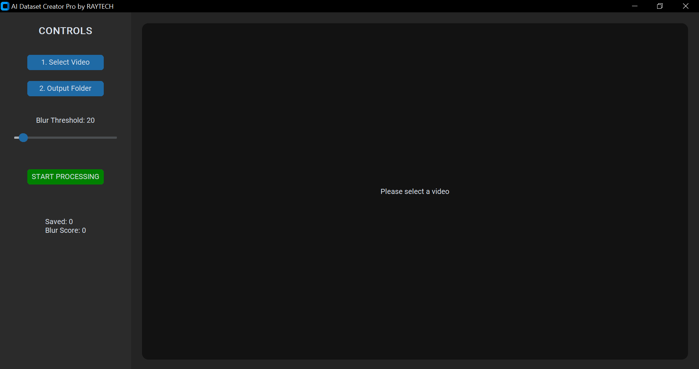

# AI Dataset Creator


AI Dataset Creator is a lightweight tool that extracts **high-quality image datasets from video files**.
It features a **modern GUI built with CustomTkinter** and allows users to filter blurry frames using a configurable **blur threshold slider**.

This tool is designed to help developers quickly prepare datasets for **computer vision and AI training**.

---

# Features

✔ Modern **CustomTkinter GUI**
✔ Select video using **file dialog**
✔ Choose **output directory** easily
✔ **Blur threshold slider** to filter blurry frames
✔ Video preview inside GUI
✔ Automatic dataset folder creation
✔ Organized dataset sessions (`session0`, `session1`, etc.)
✔ Fast frame extraction using **OpenCV**

---

# Screenshots

Add screenshots of your GUI here.

Example:

```
    gui_main.png
```

Then display it in README:



---

# How It Works

1. Select a **video file**.
2. Select an **output folder**.
3. Adjust the **blur threshold** using the slider.
4. Start the extraction process.
5. The program analyzes each frame.
6. Clear frames are saved as dataset images.

---

# Output Dataset Structure

```text
destination_folder/

├── session0
│   ├── img_0001.jpg
│   ├── img_0002.jpg
│   └── img_0003.jpg
│
├── session1
│   ├── img_0001.jpg
│   └── img_0002.jpg
│
└── session2
    ├── img_0001.jpg
```

Each run creates a **new session folder** to avoid overwriting previous datasets.

---

# Installation

Clone the repository

```bash
git clone https://github.com/rehmanaliyousaf/ai_dataset_creator_pro.git
```

Go to the project folder

```bash
cd ai_dataset_creator_pro
```

Install dependencies

```bash
pip install -r requirements.txt
```

Run the program

```bash
python main.py
```

---

# Requirements

* Python 3.8+
* OpenCV
* CustomTkinter
* Pillow

Install dependencies with:

```bash
pip install -r requirements.txt
```

---

# Project Structure

```text
ai_dataset_creator_pro/

├── main.py
├── requirements.txt
├── README.md
│
├── screenshots
│   └── gui_main.png
│
└── datasets
```

---

# Use Cases

This tool is helpful for:

* Creating datasets for **YOLO object detection**
* Preparing images for **pose detection models**
* Generating datasets for **image classification**
* Extracting frames from **surveillance or recorded videos**
* Building **custom AI datasets**

---

# Future Improvements

* Frame extraction interval control
* Batch video processing
* Dataset statistics panel
* Automatic labeling support
* Export dataset report

---

# License

This project is licensed under the **MIT License**.

---

# Author

Developed by **Rehman Ali Yousaf**

If you find this project useful, please ⭐ star the repository.

